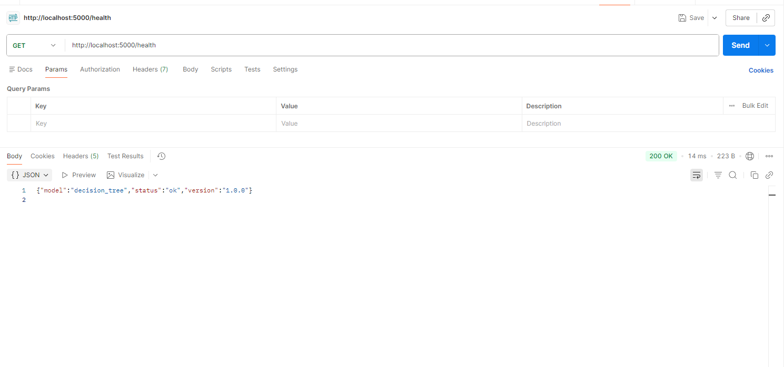
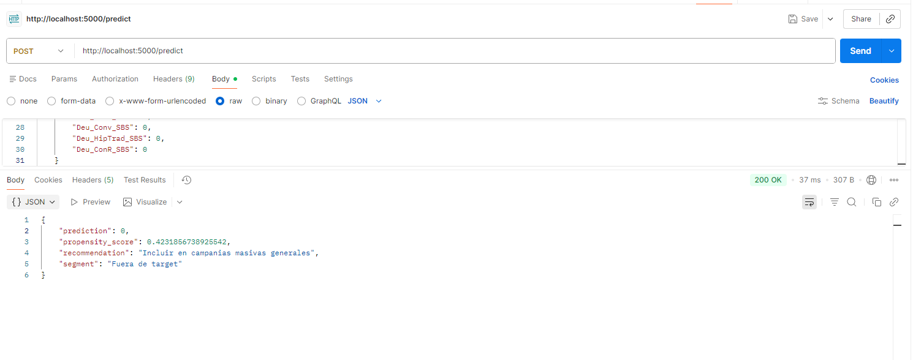
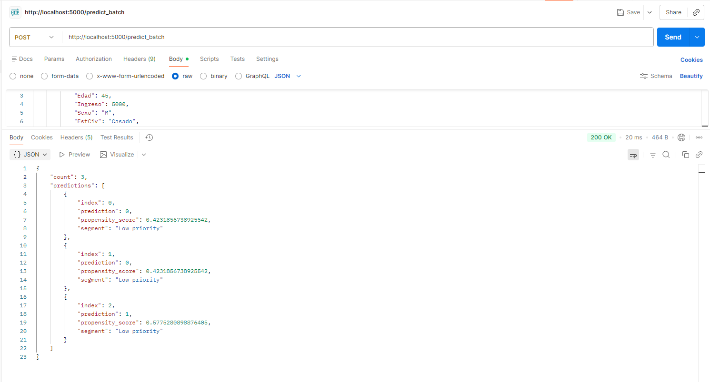

# MLOps Final Project: Banking Propensity Prediction

Este repositorio contiene el proyecto final del curso «Introducción a MLOps». El proyecto sigue el ciclo de vida completo del aprendizaje automático, desde la definición del problema hasta la implementación y el servicio del modelo, aplicando las mejores prácticas en ingeniería de software y MLOps.

## Student Information
- Full name: Victor Colcas
- Email: victor.colcas.m@uni.pe

## Project Overview
El objetivo de este proyecto es desarrollar, evaluar e implementar un modelo de aprendizaje automático para predecir la propensión de los clientes a adquirir productos bancarios. El flujo de trabajo se ajusta al ciclo de vida estándar del aprendizaje automático, que incluye la adquisición de datos, la experimentación, el desarrollo, la implementación y la documentación.

## Estructura del Proyecto
- `data/raw/`: Contiene el conjunto de datos original sin procesar.
- `data/training/`: Almacena el conjunto de datos procesado para entrenamiento (capa silver).
- `src/`: Código fuente para la preparación de datos, entrenamiento de modelos y servicio del modelo.
- `models/`: Modelos entrenados y serializados.
- `notebooks/`: Notebooks de Jupyter para análisis exploratorio y experimentación.
- `experiments/`: Scripts y resultados de experimentación de modelos.
- `reports/`: Reportes técnicos y de negocio, incluyendo análisis y evaluación.
- `tests/`: Scripts para pruebas de la API y del modelo.
- `resources/`: Recursos adicionales (imágenes, métricas, etc).

## Implementación del Ciclo de Vida de ML

### 1. Definición del Problema
- El proyecto aborda el reto de identificar clientes con alta propensión a adquirir productos bancarios, buscando optimizar las estrategias de marketing y la asignación de recursos.
- El contexto de negocio, restricciones, objetivos y beneficios esperados se detallan en [final_project_description.md](final_project_description.md) y [reports/business_insights.md](reports/business_insights.md).

### 2. Adquisición y Preparación de Datos
- Los datos crudos se almacenan en `data/raw/`.
- La preparación de datos se realiza en `src/data_preparation.py`, transformando los datos crudos en un conjunto de datos estructurado para entrenamiento (capa silver) con mapeos legibles.
- La descripción de variables y la lógica de transformación se documentan en el código y los notebooks.

### 3. Experimentación en ML
- El análisis exploratorio y las pruebas de hipótesis se realizan en `notebooks/propension_eda.ipynb`.
- La selección y evaluación de modelos se lleva a cabo en `src/train.py` y se registra en `experiments/`.
- Métricas, gráficos y comparaciones de modelos se incluyen en `reports/`.

### 4. Desarrollo del Modelo
- La lógica de entrenamiento se implementa en `src/train.py`, incluyendo preprocesamiento, entrenamiento, evaluación y serialización.
- El mejor modelo se selecciona en función del ROC AUC y la precisión, y se guarda en `models/`.

### 5. Despliegue y Servicio del Modelo
- El modelo se sirve mediante una API REST usando Flask (`src/serving.py`).
- Los endpoints incluyen verificación de salud, predicción individual y por lotes, e información del modelo.
- Las instrucciones de uso y ejemplos se encuentran en [src/API_USAGE.md](src/API_USAGE.md).
- Las pruebas de la API se realizan con scripts en `tests/`.

### 6. Documentación y Entrega
- Este README.md sirve como documentación central del proyecto.
- Reportes adicionales, imágenes y recursos están disponibles en las carpetas `reports/` y `resources/`.
- Todo el código, los conjuntos de datos y la documentación se mantienen en este repositorio público.

## Cómo ejecutar el proyecto
1. Clonar el repositorio y configurar el entorno Python según lo especificado en `requirements.txt`.
2. Preparar los datos usando `src/data_preparation.py`.
3. Entrenar y evaluar los modelos con `src/train.py`.
4. Servir la API del modelo con `src/serving.py`.
5. Probar la API usando los scripts en `tests/`.

## Referencias
- [final_project_description.md](final_project_description.md): Requerimientos y guía del proyecto.
- [reports/business_insights.md](reports/business_insights.md): Análisis de negocio y hallazgos.
- [src/API_USAGE.md](src/API_USAGE.md): Instrucciones de uso de la API.

Para más detalles, consulte los documentos y archivos de código vinculados. Los ítems opcionales (seguimiento de experimentos, registro en MLflow, reportes avanzados) se consideran para puntos adicionales en la evaluación.

## Ejemplos de Respuestas del API

A continuación se muestran ejemplos visuales de las respuestas de los principales endpoints del API:

### /health

### /predict

### /predict_batch

